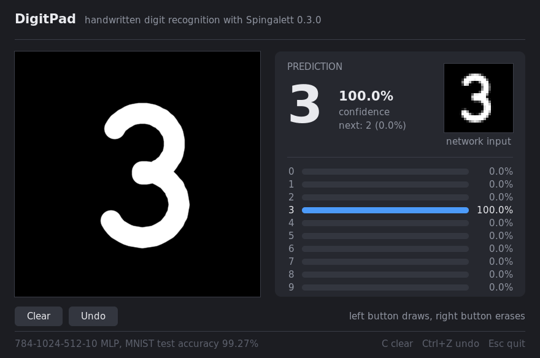

<div align="center">

<picture>
  <source media="(prefers-color-scheme: dark)" srcset="Images/LogoDark.png">
  <source media="(prefers-color-scheme: light)" srcset="Images/LogoLight.png">
  
</picture>

[](https://github.com/pka-human/Spingalett/actions/workflows/ci.yml)
[](https://en.wikipedia.org/wiki/C23_(C_standard_revision))
[](LICENSE)
[](https://deepwiki.com/pka-human/Spingalett)

</div>

Spingalett is a neural-network library written in C23 for training and running fully connected
networks on the CPU. It depends only on the C standard library: batch training and inference run
as matrix-matrix products on built-in AVX-512, AVX2 or portable kernels, with OpenMP and OpenBLAS
as optional build-time accelerators. Networks are declared with C23 designated initializers, all
parameters live in flat contiguous arrays, and models can be saved in reduced precision down to
2 bits per weight. Python bindings are included.

## Contents

- [Features](#features)
- [Building](#building)
- [Quick start](#quick-start)
- [Usage](#usage)
- [Python bindings](#python-bindings)
- [DigitPad demo](#digitpad-demo)
- [Performance](#performance)
- [Project layout](#project-layout)
- [Status and roadmap](#status-and-roadmap)
- [Contributing](#contributing)
- [License](#license)

## Features

| Area | Supported |
|---|---|
| Layers | Fully connected, optional dropout per layer |
| Activations | Sigmoid, ReLU, Leaky ReLU, Tanh, FOO52, Softmax (output layer), None |
| Losses | Mean squared error, cross-entropy (softmax or sigmoid outputs) |
| Optimizers | SGD, Momentum, RMSProp, Adam, AdamW; L2 or decoupled weight decay |
| Training | Per-sample, full-batch and mini-batch strategies; in-memory arrays or a data generator |
| Regularization and stability | Dropout, weight decay, global gradient-norm clipping, NaN/Inf detection |
| Learning-rate schedules | Cosine decay, linear warm-up, step decay, warm-up + cosine, or a custom callback |
| Initialization | Uniform, Glorot (Xavier), He and LeCun normal |
| Inference | Per-sample `forward()` and batched `predict()` |
| Backends | Built-in matrix kernels (AVX-512, AVX/FMA, portable C), single-threaded or OpenMP; OpenBLAS |
| Serialization | FP32, FP16, BF16, INT8, INT4, INT2; optional optimizer state; versioned format |
| Bindings | Python (ctypes + NumPy) |

## Building

Requirements: CMake 3.21 or newer and a compiler with C23 support. GCC 13 and Clang 18 are tested
in CI; MSVC 19.36 or newer is expected to work but is not tested. OpenMP and OpenBLAS are
optional.

```bash
# Dependency-free build
cmake -S . -B Build -DCMAKE_BUILD_TYPE=Release
cmake --build Build --parallel

# With OpenMP and OpenBLAS (Debian/Ubuntu: apt install libopenblas-dev)
cmake -S . -B Build -DCMAKE_BUILD_TYPE=Release -DBUILD_WITH_OPENMP=ON -DBUILD_WITH_OPENBLAS=ON
cmake --build Build --parallel

# Run the test suite
ctest --test-dir Build --output-on-failure

# Install headers and the shared library
cmake --install Build --prefix /usr/local
```

The shared library and the example programs are written to `Bin/`, import libraries to `Lib/`.
By default the library is compiled with `-march=native` and therefore tuned for the build
machine; for redistributable binaries, configure with `-DSPINGALETT_NATIVE_ARCH=OFF` and choose
a baseline through `CMAKE_C_FLAGS` (for example `-march=x86-64-v3` for AVX2).

| CMake option | Default | Description |
|---|---|---|
| `BUILD_WITH_OPENMP` | `OFF` | Enable the OpenMP backend |
| `BUILD_WITH_OPENBLAS` | `OFF` | Enable the OpenBLAS backend (found via pkg-config or the default library paths) |
| `BUILD_EXAMPLE` | `ON` | Build the programs in `Examples/` |
| `BUILD_TESTS` | `ON` | Build the test suite and register it with CTest |
| `BUILD_APPS` | `OFF` | Build the DigitPad demo (needs SDL2) and its trainer |
| `SPINGALETT_NATIVE_ARCH` | `ON` | Compile with `-march=native`; turn off for binaries that must run on other machines |
| `SPINGALETT_BIN_DIR` | `<source>/Bin` | Output directory for executables and shared libraries |
| `SPINGALETT_LIB_DIR` | `<source>/Lib` | Output directory for static and import libraries |

An installed Spingalett is found with CMake's `find_package`; projects that vendor the
repository can use `add_subdirectory()` instead. Both provide the target `Spingalett::spingalett`,
which carries the include paths:

```cmake
find_package(Spingalett 0.3 REQUIRED)        # or: add_subdirectory(external/Spingalett)
target_link_libraries(my_app PRIVATE Spingalett::spingalett)
```

The headers define `SPINGALETT_VERSION_MAJOR`, `_MINOR`, `_PATCH` and `_STRING`;
`spingalett_version()` returns the version of the library actually loaded.

## Quick start

```c
#include <Spingalett/Spingalett.h>
#include <stdio.h>

int main(void) {
    float inputs[4][2]  = {{0, 0}, {0, 1}, {1, 0}, {1, 1}};
    float targets[4][1] = {{0}, {1}, {1}, {0}};

    NeuralNetwork *net = new_spingalett(LOSS_MSE);
    layer(net, 2);                                              /* input layer */
    layer(net, 8, ACT_TANH, WEIGHT_INITIALIZATION_XAVIER);
    layer(net, 1, ACT_SIGMOID, WEIGHT_INITIALIZATION_XAVIER);

    train(
        .net = net,
        .inputs = &inputs[0][0],
        .targets = &targets[0][0],
        .sample_count = 4,
        .epochs = 5000,
        .training_strategy = STRATEGY_FULL_BATCH,
        .optimizer_type = OPTIMIZER_ADAM,
        .learning_rate = 0.02f,
        .report_interval = 1000
    );

    for (int i = 0; i < 4; i++) {
        float *out = forward(net, inputs[i]);
        printf("%.0f XOR %.0f = %.4f\n", inputs[i][0], inputs[i][1], out[0]);
    }

    save_spingalett(.net = net, .filename = "xor");             /* writes xor.nn */
    free_network(net);
    return 0;
}
```

Every function that takes many parameters is a macro over a struct, so arguments can be given
positionally (`layer(net, 8, ACT_TANH)`) or by name (`layer(.net = net, .neurons_amount = 8)`).
Fields that are not mentioned are zero, which selects the documented default.

The `Examples/` directory contains this XOR program, an MNIST classifier
(`Examples/download_mnist.sh data/mnist && Bin/MNIST data/mnist`) and the benchmark described under
[Performance](#performance).

## Usage

### Defining a network

`new_spingalett(loss)` creates an empty network; each `layer()` call appends a layer, the first
one being the input layer. `LayerArgs` fields:

| Field | Meaning |
|---|---|
| `neurons_amount` | Layer width |
| `act_func` | Activation of this layer (ignored for the input layer) |
| `weight_initialization` | `RANDOM` (uniform in [-1, 1]), `XAVIER` (Glorot normal, variance 2/(fan_in + fan_out)), `HE` (normal, variance 2/fan_in), `LECUN` (normal, variance 1/fan_in), `NONE` (zeros) |
| `dropout_rate` | Probability in [0, 1) of zeroing each output of this layer during training |

Biases start at zero. Softmax is only allowed in the output layer. Leaky ReLU uses a slope of
0.01; FOO52 is the piecewise-linear function `0.01x` for `x < 0`, `x` on `[0, 1]` and
`1 + 0.01(x - 1)` above 1.

Dropout is inverted (kept units are scaled by `1 / (1 - p)`), so inference needs no rescaling.
It is not applied to the input or output layer.

### Training

`train()` takes a `TrainArgs` struct. Zero-valued fields use the defaults below.

| Field | Default | Description |
|---|---|---|
| `inputs`, `targets`, `sample_count` | required | Row-major arrays of `sample_count` samples |
| `epochs` | required | Number of passes over the data |
| `training_strategy` | `STRATEGY_SAMPLE` | `STRATEGY_SAMPLE` (one step per sample), `STRATEGY_FULL_BATCH`, `STRATEGY_SMALL_BATCH` |
| `batch_size` | 32 | Mini-batch size |
| `do_not_shuffle` | false | Per-sample and mini-batch training reshuffle the samples every epoch unless set |
| `optimizer_type` | `OPTIMIZER_SGD` | `SGD`, `MOMENTUM`, `RMSPROP`, `ADAM`, `ADAMW` |
| `learning_rate` | 0.01 | Base learning rate |
| `momentum` | 0.9 | Momentum coefficient |
| `beta1`, `beta2`, `epsilon` | 0.9, 0.999, 1e-8 | Adam/RMSProp moment parameters; epsilon is added to the square root of the second moment, as in PyTorch |
| `weight_decay` | 0 | L2 penalty; decoupled (`w *= 1 - lr * wd`) for AdamW. Biases are not decayed |
| `max_grad_norm` | 0 (off) | Clip the global L2 norm of every step's gradient |
| `lr_scheduler`, `lr_scheduler_data` | none | Learning-rate schedule, see below |
| `reset_optimizer` | false | Clear moment estimates and the step counter before training |
| `nan_check_interval` | 0 (off) | Stop when weights become NaN/Inf, checked every N epochs |
| `report_interval` | 0 (off) | Log the training loss every N epochs |
| `callback`, `callback_interval` | none, 1 | `bool cb(NeuralNetwork *, size_t epoch, float loss)`; return `true` to stop |
| `autosave_mode`, `autosave_interval`, `autosave_path` | off | Periodic checkpoints (`AUTOSAVE_OVERWRITE` or `AUTOSAVE_NEW_FILES`, which appends `_epoch_N`) |
| `autosave_precision`, `autosave_do_not_save_optimizer` | FP32, false | Checkpoint format |
| `blas_num_threads` | 0 (auto) | OpenBLAS threads during training, see [Backends](#backends-and-threading) |

The reported loss is averaged over the samples of an epoch: the sum of squared errors per sample
for MSE, and categorical (softmax) or binary (sigmoid) cross-entropy otherwise. Cross-entropy
requires a softmax or sigmoid output layer; `train()` rejects other combinations.

Optimizer state (moment estimates and the step counter used for Adam's bias correction) is stored
in the network, so training can be resumed by calling `train()` again or after loading a
checkpoint that includes the optimizer state.

### Learning-rate schedules

```c
typedef float (*LRSchedulerFn)(size_t epoch, size_t total_epochs, float initial_lr, void *user_data);
```

The scheduler runs before every epoch; `epoch` counts the epochs already completed (0 for the
first). Four schedules are built in and take an optional `LRScheduleParams` as `user_data`:

```c
LRScheduleParams schedule = {.warmup_epochs = 10, .min_lr = 1e-5f};
train(.net = net, /* ... */ .learning_rate = 1e-3f,
      .lr_scheduler = spingalett_lr_warmup_cosine, .lr_scheduler_data = &schedule);
```

| Function | Parameters used |
|---|---|
| `spingalett_lr_cosine_decay` | `min_lr` |
| `spingalett_lr_linear_warmup` | `warmup_epochs` (default 5% of the run) |
| `spingalett_lr_step_decay` | `step_size` (default a third of the run), `gamma` (default 0.1) |
| `spingalett_lr_warmup_cosine` | `warmup_epochs`, `min_lr` |

### Data generators

For datasets that do not fit in memory, or data produced on the fly, set
`.training_mode = MODE_GENERATOR_FUNCTION` and supply a generator:

```c
typedef uint32_t (*DataGeneratorFn)(float *inputs, float *targets, uint32_t requested, void *user_data);
```

The generator writes up to `requested` samples (row-major) and returns how many it wrote;
returning 0 ends the epoch. It is called once per mini-batch, once per epoch for full-batch
training (requesting `sample_count` samples, which is then required) and in chunks for per-sample
training. In this mode `sample_count` optionally caps the number of samples per epoch, which
allows endless generators. Shuffling and augmentation are the generator's responsibility.

### Inference

`forward(net, input)` evaluates one sample and returns a pointer to the output layer inside the
network; the buffer is overwritten by the next call. `predict()` evaluates many samples at once
with matrix-matrix products and is the faster choice for more than a handful of inputs:

```c
float *outputs = malloc(count * output_size * sizeof(float));
predict(.net = net, .inputs = inputs, .sample_count = count, .outputs = outputs);   /* false on error */
```

Dropout is not applied during inference.

### Saving and loading

```c
save_spingalett(.net = net, .filename = "model.nn", .precision = PRECISION_FP16, .do_not_save_optimizer = true);
NeuralNetwork *net = load_spingalett("model.nn");
```

`.nn` is appended when the filename has no extension. Weights, biases and, unless disabled, the
optimizer state are stored in the selected precision:

| Precision | Storage per value | Notes |
|---|---|---|
| `PRECISION_FLOAT32` | 4 bytes | Lossless |
| `PRECISION_FP16`, `PRECISION_BFLOAT16` | 2 bytes | Round to nearest even |
| `PRECISION_INT8`, `PRECISION_INT4` | 1 byte, 4 bits | Symmetric, one scale per tensor |
| `PRECISION_INT2` | 2 bits | Ternary {-scale, 0, +scale} |

The file format is versioned (`SPINGALETT_FORMAT_VERSION`, currently 2); version 1 files remain
loadable. Values are stored in native byte order. `load_spingalett()` returns `NULL` for missing
or truncated files and for files with an invalid header.

### Backends and threading

```c
spingalett_set_compute_mode(COMPUTE_OPENBLAS);   /* COMPUTE_SINGLE_THREADED, COMPUTE_OPENMP, COMPUTE_OPENBLAS */
spingalett_set_num_threads(8);                   /* 0 = runtime default */
```

Full-batch and mini-batch training and `predict()` process samples in chunks of up to 2048 as
matrix-matrix products; per-sample training and `forward()` use matrix-vector kernels.

- `COMPUTE_SINGLE_THREADED` uses the built-in kernels: AVX-512 or AVX/FMA when the compiler
  targets them, portable C otherwise.
- `COMPUTE_OPENMP` uses the same kernels on all threads; operations that are too small to benefit
  run serially.
- `COMPUTE_OPENBLAS` delegates matrix products to OpenBLAS. It is usually on par with OpenMP for
  large batches and slower for small ones. During training, `blas_num_threads = 0` uses a single
  OpenBLAS thread when each call is too small to amortize threading and the configured thread
  count otherwise, and restores the caller's setting afterwards; outside `train()`, OpenBLAS uses
  its own thread configuration (`OPENBLAS_NUM_THREADS`).
- A requested backend that was not compiled in falls back to single-threaded with a one-time
  warning. `COMPUTE_CUDA` is reserved and currently falls back as well.

Results agree across backends up to floating-point rounding. For the duration of `train()`,
denormal floats are flushed to zero on the calling thread and the OpenMP workers; the previous
floating-point mode is restored afterwards.

A network must not be used by several threads at the same time. Compute mode, thread count and
logging settings are process-wide; the random generator and the error state are per thread.

### Reproducibility

`spingalett_seed(seed)` seeds the calling thread's generator, which drives weight
initialization, mini-batch shuffling and dropout. With a fixed seed, training is deterministic,
and dropout masks are identical across backends and thread counts.

### Errors and logging

Functions report failures through a thread-local error state instead of return codes:

```c
spingalett_clear_error();
NeuralNetwork *net = load_spingalett("model.nn");
if (!net)
    fprintf(stderr, "%s (code %d)\n", spingalett_last_error_message(), spingalett_last_error_code());
```

| Code | Meaning |
|---|---|
| `SPINGALETT_OK` | No error |
| `SPINGALETT_ERR_ALLOC` | Out of memory |
| `SPINGALETT_ERR_INVALID` | Invalid argument or file contents |
| `SPINGALETT_ERR_FILE_IO` | A file could not be opened, read or written, or is truncated |
| `SPINGALETT_ERR_FORMAT_VERSION` | The model file uses an unsupported format version |

The error state is not cleared by successful calls.

Log messages go to stdout (warnings and errors to stderr) unless redirected with
`spingalett_set_log_callback(void (*)(LogLevel, const char *))`. `spingalett_set_log_level()` sets
the minimum level and `spingalett_set_verbose(false)` suppresses everything below warnings.

## Python bindings

`Bindings/Python` contains pure-Python bindings built on `ctypes` and NumPy; nothing is compiled
at install time.

```bash
pip install ./Bindings/Python
export SPINGALETT_LIBRARY=$PWD/Bin/libspingalett.so
```

```python
import numpy as np
import spingalett as sg

x = np.array([[0, 0], [0, 1], [1, 0], [1, 1]], dtype=np.float32)
y = np.array([[0], [1], [1], [0]], dtype=np.float32)

with sg.Network(sg.Loss.MSE, [sg.Layer(2),
                              sg.Layer(16, sg.Activation.TANH, sg.Init.XAVIER),
                              sg.Layer(1, sg.Activation.SIGMOID, sg.Init.XAVIER)]) as net:
    net.train(x, y, epochs=3000, optimizer=sg.Optimizer.ADAM, learning_rate=0.02,
              lr_scheduler=sg.CosineDecay())
    print(net.forward(x))
```

See [Bindings/Python/README.md](Bindings/Python/README.md) for the full API.

## DigitPad demo

[Apps/DigitPad](Apps/DigitPad) is a desktop app in which you draw a digit with the mouse and a
Spingalett network classifies it as you draw. Its 784-1024-512-10 model, trained with on-the-fly
augmentation through a data generator, reaches 99.27% MNIST test accuracy. The directory contains
the app, the trainer and a script that packages both the app and the model as a self-contained
Linux AppImage.



## Performance

`Examples/Benchmark.c` measures a 784-512-1000-10 network (925K parameters, ReLU, softmax with
cross-entropy, Adam) on 20,000 synthetic samples: full-batch training (5 epochs), mini-batch
training (batches of 64, one epoch) and batched inference. `Examples/benchmark_pytorch.py` runs the
same workload in PyTorch. Run them with `Bin/Benchmark [threads]` and
`python Examples/benchmark_pytorch.py [threads]`.

Samples per second on a 4-vCPU cloud VM (Intel Xeon @ 2.10 GHz, AVX-512). Spingalett 0.3 was built
with GCC 13 and uses its built-in kernels (no BLAS library); PyTorch 2.14.1 is the CPU build
from PyPI (Intel MKL and oneDNN):

| | Threads | Full batch | Mini-batch 64 | Inference |
|---|---:|---:|---:|---:|
| Spingalett | 1 | 24,343 | 16,094 | 58,174 |
| PyTorch | 1 | 21,307 | 7,974 | 52,959 |
| Spingalett (OpenMP) | 4 | 81,469 | 41,623 | 222,502 |
| PyTorch | 4 | 68,648 | 16,425 | 177,176 |

The gap is largest for mini-batches, where fixed per-step costs weigh most. With
`COMPUTE_OPENBLAS` (OpenBLAS 0.3.26) Spingalett reaches 77,469 samples/s in full-batch and 32,478
in mini-batch training on four threads.

Against 0.2 on the same machine, full-batch training without OpenBLAS is 7.2x faster on one thread
and 7.5x faster with OpenMP. Against 0.1, per-sample training (`STRATEGY_SAMPLE`) is about 11x
faster, mainly because denormals are flushed to zero during training.

`Examples/MNIST.c` trains a 784-256-128-10 network with dropout (AdamW, cosine schedule,
mini-batches of 128) to 98.3% test accuracy in 3.6 s: 10 epochs over 60,000 images with OpenMP on
the same VM.

## Project layout

```
Include/Spingalett/   Public header and the CMake-generated configuration header template
Src/                  Library sources (network, training, SIMD kernels, serialization, ...)
Examples/             XOR, MNIST, throughput benchmark (C and PyTorch counterpart)
Apps/DigitPad/        Digit-drawing demo app, its trainer and AppImage packaging
Tests/                Test suite (CTest) and fixtures
Bindings/Python/      Python bindings
```

## Status and roadmap

Spingalett is at version 0.3; the C API and the in-memory `NeuralNetwork` layout may still change
between minor versions (see [CHANGELOG.md](CHANGELOG.md)). Saved models are versioned and remain
loadable.

Planned work, roughly in order:

- 0.4: validation data, metrics and early stopping; dataset readers (IDX, CSV, binary files)
- 0.5: an opaque network handle and a layer abstraction; batch normalization, 2D convolution and
  pooling layers
- 1.0: API freeze, C++ wrapper
- Later: CUDA backend, ARM NEON kernels, further language bindings

## Contributing

Bug reports and pull requests are welcome. Please make sure the test suite passes
(`ctest --test-dir Build --output-on-failure`) for both a minimal build and a build with
`-DBUILD_WITH_OPENMP=ON -DBUILD_WITH_OPENBLAS=ON`, and add tests for new behaviour. CI runs the
suite with GCC and Clang, without `-march=native` (portable kernels) and under AddressSanitizer
and UndefinedBehaviorSanitizer.

## License

Spingalett is released under the [MIT License](LICENSE).
